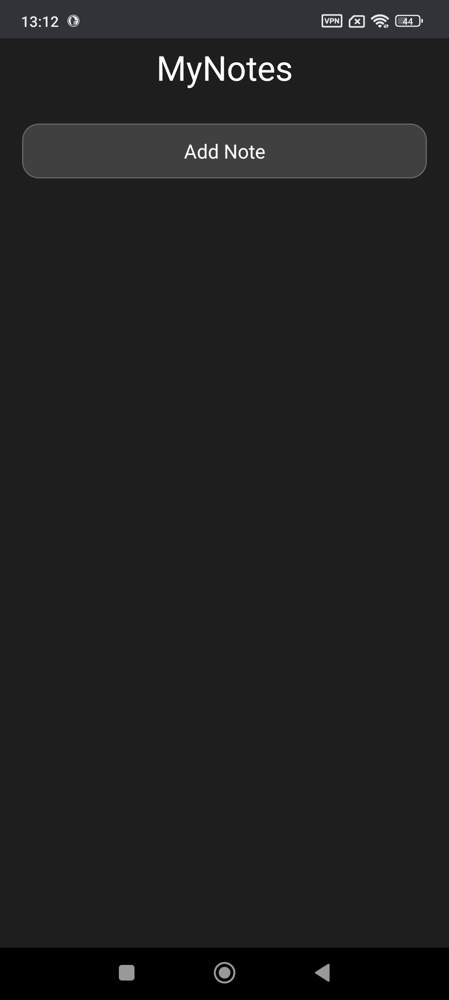
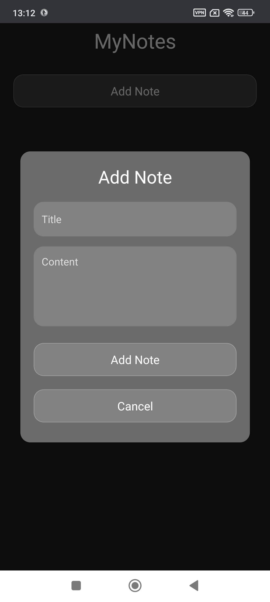
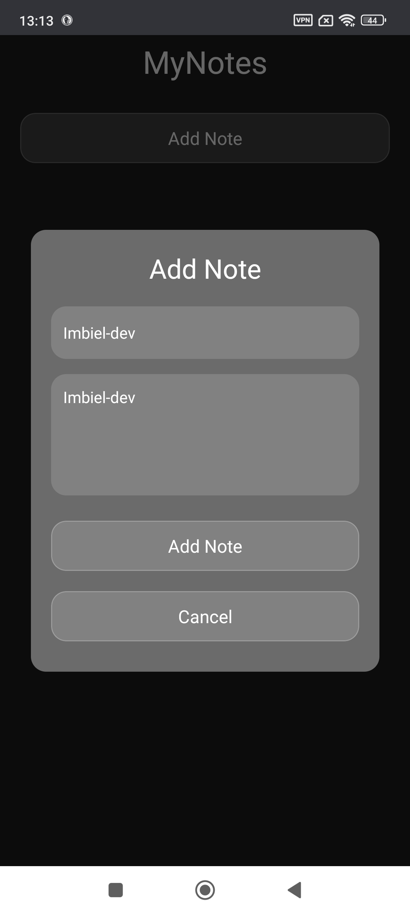
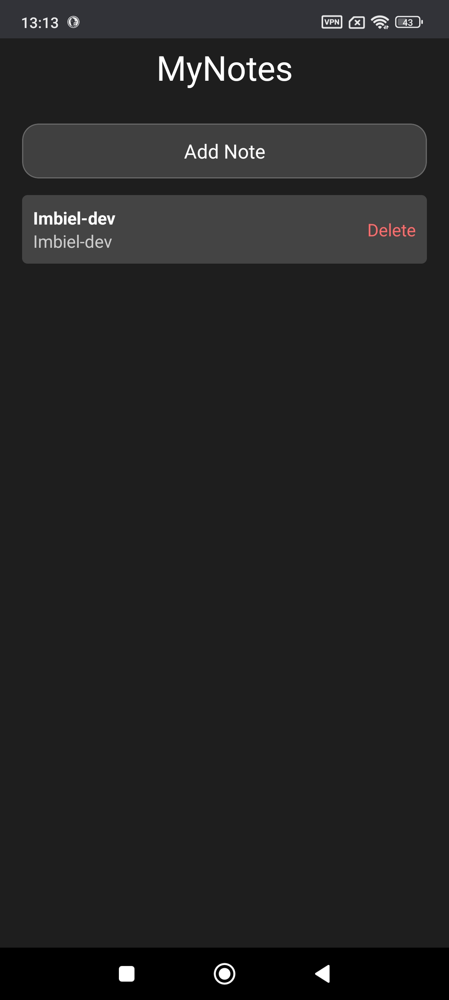

[](https://choosealicense.com/licenses/mit/)
---
# :star: MyNotes
A simple and elegant note-taking app designed to help users quickly jot down notes and manage them efficiently. This project was developed as a training exercise to practice building a React Native app with glassmorphism effects and persistent storage using AsyncStorage. It is suitable for anyone looking to build similar applications or learn about these technologies.

# :camera: Screenshots






# :sparkles: Features
- Add Notes: Users can add new notes with a title and content.
- Edit Notes: Users can edit existing notes.
- Delete Notes: Users can delete notes they no longer need.
- Glassmorphism Design: A modern, elegant design with glassmorphism effects.
- Persistent Storage: Notes are saved using AsyncStorage, ensuring they persist across app restarts.

# :hammer_and_wrench: Stack used

**Front-end:** React Native, Expo, Expo-Blur

**Back-end:** None (client-side storage using AsyncStorage)


# :package: Prerequisites
``` bash
npx expo install @react-native-async-storage/async-storage
```
``` bash
npx expo install expo-blur 
 ```
# :books: Reference
- [Expo Documentation](https://docs.expo.dev/)
- [AsyncStorage Documentation](https://docs.expo.dev/versions/latest/sdk/async-storage/)
- [Blur Documentation](https://docs.expo.dev/versions/latest/sdk/blur-view/)

# :page_facing_up: License

[MIT](https://choosealicense.com/licenses/mit/)

# :busts_in_silhouette: Authors
- [@imbiel-dev](https://www.github.com/imbiel-dev)